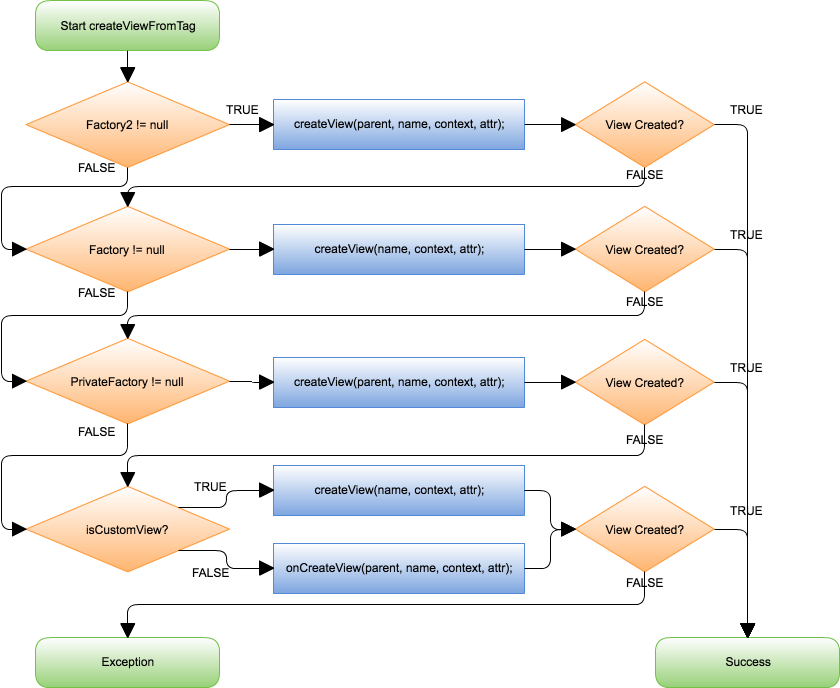
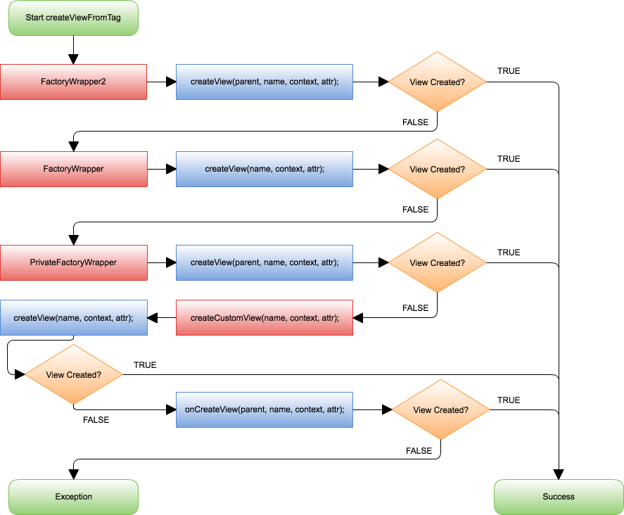
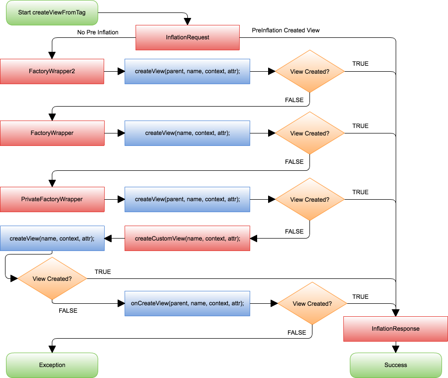

footer: **Creative Commons - @Chrisjenx - @OWLR, 2017** - [http://chrisjenx.com]()
slidenumbers: true
build-lists: true

---

## [fit] LayoutInflater
### A dive in

---

## Who am I?

- CTO of @OWLR

- Android Engineer 6+ years
  - Met Office
  - Yoyo Wallet

- Social Stuff:
  - Web: [http://chrisjenx.com]()
  - Twitter: @chrisjenx

---

## Whats the Story?
## 物語は何ですか？

^ I like to try and storify these talks.

---

## Winter 2013

^ I was working for a startup.

---

## I wanted to do this:

```xml
<TextView
  font="RobotoBold.ttf"
  />
```

---

## And this:

```xml
<style name="MyTheme">
  <!-- Default Font -->
  <item name="font">Roboto-Regular.ttf</item>
</style>
```

---

## Stuck with this:

```xml
<com.myapp.RobotoBoldTextView />
```

```java
public class RobotoBoldTextView extends TextView {
  public RobotoTextView(Context context, @Nullable AttributeSet attrs) {
    super(context, attrs);
    setTypeface(Typeface.createFromFile("assets/fonts/Roboto-Bold.ttf"));
  }
}
```
---
## Problems?

- Difficult to extend (Now can't extend `AppCompat !extend RobotoTextView`)
- Definitely not composeable
- Difficult to change/update
- Mixing design with implementation detail.

---

## Custom Attributes?

```xml
<declare-styleable name="CustomTextView">
  <attr name="font" format="string" />
</declare-styleable>
```


```java
public class CustomTextView extends TextView {
  public CustomTextView(Context context,
      @Nullable AttributeSet attrs, int defStyle) {
    super(context, attrs);
    TypedArray a = context.obtainStyledAttributes(
        attrs, R.styleable.CustomTextView, defStyle, 0);
    setTypeface(Typeface.createFromFile(
        a.getString(R.styleable.CustomTextView_font)));
    a.recycle();
  }
}
```

---
## Same Problems

- Difficult to extend (Still can't extend. `AppCompat !extend CustomTextView`)
- Still not composeable

---

## Is this possible?

```xml
<AnyTextView
  font="RobotoBold.ttf"
  />
```

^ Technically it's not... But I worked out a way...

---

## [Calligraphy](http://github.com/chrisjenx/Calligraphy) was born.

^ Don't worry about the link, more on that later.

---

## _LayoutInflation Injection_

^ Mouthful thus Calligraphy.

---

## What? 何!

^ We'll get back to how that works later.
THis talk is about the things I learnt during the creation of Callgriaphy and
working with the layout inflater and trying to do inflation injection.

---

## Layout Inflation

- First, How do we use it.

---
## Layout Inflation

- ~~First, How do we use it.~~
- First, How do we use it, **correctly**.
- How does it work? どのように機能するのですか？
- Lets "ViewPump" - えっ?!

---

## Using the LayoutInflater, correctly!

The **only** way to get the `LayoutInflater`:

<br />

```java
LayoutInflater inflater =
    LayoutInflater.from(Context context);
```

^ Actually not true.

---

## Using the LayoutInflater, correctly!

The ~~only~~ **safest** way to get an instance:

```java
LayoutInflater inflater =
    LayoutInflater.from(Context context);
```

---

## Using the LayoutInflater, correctly!

The ~~only~~ **safest** way to get an instance:

```java
LayoutInflater inflater =
    LayoutInflater.from(Context context);
```
It does this:

```java
(LayoutInflater) context
      .getSystemService(Context.LAYOUT_INFLATER_SERVICE);
```

---

## Let's be clear!

Unsafe: `getActivity()` or `getLayoutInflater()`.

```java
public View onCreateView(LayoutInflater inflater, ViewGroup container,
      Bundle savedInstanceState) {
    return getActivity().getLayoutInflater()
        .inflate(fragment_order_list, container, false);
}
```
Correct:

```java
public View onCreateView(LayoutInflater inflater, ViewGroup container,
      Bundle savedInstanceState) {
    return inflater
        .inflate(fragment_order_list, container, false);
}
```

---

## But, You just said!

Use:

```java
LayoutInflater.from(Context context);
```
</br>
Correct, this is the only known exception.

```java
Fragment::onCreateView(LayoutInflater inflater, ...)
```

^ There might be other exceptions, but the rule is if it's not passed into you.
Use `from`

___

## Examples

MyListAdapter.java

```java
@Override
public View getView(int position, View convertView,
    ViewGroup parent) {
  // Use context directly above us. i.e "Parent"
  LayoutInflater inflater =
      LayoutInflater.from(parent.getContext());
  //...
  View view = inflater
      .inflate(R.layout.my_list_item, parent, false);
  return view;
}
```

–––

## Examples Cont.

RecycleView.MyAdapter.java

```java
@Override
public MyAdapter.ViewHolder onCreateViewHolder(
    ViewGroup parent, int viewType) {
  // Use context directly above us. i.e. "Parent"
  View v = LayoutInflater.from(parent.getContext())
      .inflate(R.layout.my_text_view, parent, false);
  //...
  return new ViewHolder(v);
}
```

---

## Examples Cont.

MyView.java

```java
public MyView(Context context) {
  LayoutInflater.from(context, this, true);
}
```

---

## Why is this important?

Two examples:

```java
class MyApplication extends Application {
  public void onCreate() {
    // Application LayoutInflater
    LayoutInflater.from(MyApplication.this)
  }
}
```

```java
class MyFirstActivity extends Activity {
  public void onCreate(Bundle savedInstanceState) {
    // Activity LayoutInflater
    LayoutInflater.from(MyFirstActivity.this)
  }
}
```

---

# [fit] Application Context and Theme

```java
class MyApplication extends Application {
  public void onCreate() {
    // Application LayoutInflater
    LayoutInflater.from(MyApplication.this)
  }
}
```

Uses:

```xml
<manifest>
<application
  android:theme="@android:style/Theme.DeviceDefault.Light"
  >
</manifest>
```

---

# Vs. Activity

```java
class MyDialogActivity extends Activity {
  public void onCreate(Bundle savedInstanceState) {
    LayoutInflater.from(MyDialogActivity.this) // Activity LayoutInflater
  }
}
```

Uses:

```xml
<manifest>
  <activity
    android:theme="@android:style/Theme.DeviceDefault.Dialog" />
</manifest>
```

`LayoutInflater.from(application)` will use `Theme.DeviceDefault.Light`!

^ Going to bet that you don't want to be inflating Views with the Light Theme
when you wanted the dialog theme.

---

## But, I use the same theme.

---

## But, I use the same theme.
### You do now, but future proof.

---

## We can also extend **`Context`s**

```xml
<FrameLayout
    xmlns:android="..."
    android:layout_width="match_parent"
    android:layout_height="match_parent"
    android:theme="@style/Theme.DeviceDefault.Overlay">
  <TextView
      android:layout_width="wrap_content"
      android:layout_height="wrap_content"/>
</FrameLayout>
```

^ Note the android:theme set on there.

---

## Extend `Context` not `Theme`?

Everything is a `ContextWrapper`!

- `Application extends ContextWrapper`
- `Activity extends ContextThemeWrapper`
- `ContextThemeWrapper extends ContextWrapper`

---
## Creating `ContextThemeWrapper`s

```xml
<FrameLayout
    android:theme="@style/Theme.DeviceDefault.Overlay">
```

Simple equivalent:

```java
Context context = parent.getContext().
if(hasThemeAttr) {
  int themeRes = attrs.getResourceId(THEME_ATTR, 0);
  context = new ContextThemeWrapper(parent, themeRes);
}
view = new FrameLayout(context, attrs);
```

`FrameLayout` and children will now get styled attributes from `Theme.DeviceDefault.Overlay`

---

## Overkill?

Last week:

> This issue depends on the Context used to get the LayoutInflater instance. In My PagerAdapter I was injecting Context via Dagger2 which was ApplicationContext', and I instantiated LayoutInflater in constructor using thatContext' and Calligraphy had no impact there.


---

^ Covered why context is important, Next the parent and attachToRoot params.

---

## LayoutInflater `attachToRoot` / `parent`

---

## `inflate(layoutResource, parent, attachToRoot)`

---

## `parent`

> @parent A view group that will be the parent.  Used to properly inflate the layout_* parameters.

---

## `parent`

```xml
<LinearLayout android:layout_width="match_parent"
              android:layout_height="match_parent"          
              android:orientation="vertical">
  <TextView android:layout_width="wrap_content"
            android:layout_height="wrap_content"
            android:weight="1"/>
</LinearLayout>
```
```java
inflater.inflate(layoutRes, parent, false);
// Does this:
viewGroup = createView(activity.context, ...); // FrameLayout
view = createView(viewGroup.context, ...) // TextView
// Attrs only available at inflation time!
params = viewGroup.generateLayoutParams(viewAttrs);
// Can now tell parent how to be laid out.
view.setLayoutParams(params);
```

^ If you didn't do this, then the parent wouldn't know about the child's weight
or that is should match_parent. It would use the LayoutParams Default if you
didn't do this.

---
## `attachToRoot`

```java
inflater.inflate(R.layout.activity, parent, true);

// Does this:

// FrameLayout
viewGroup = createView(activity.context, ...);
// TextView
view = createView(viewGroup.context, ...)
// Attrs only available at inflation time!
params = viewGroup.generateLayoutParams(viewAttrs);
// Add to parent and layout.
parent.addView(view, params);
```

^ Note that last line, addView, it just saves you writing another line.

---
### How to use `attachToRoot`

```java
// ListViewAdapter.java

public View getView(int position, View convertView,
      ViewGroup parent) {
  LayoutInflater inflater = LayoutInflater.from(convertView)
  // Inflate Row, parent == convertView (ListView), do not attach.
  View rowView = inflater
    .inflate(R.layout.rowlayout, parent, false);
  //..
  return rowView;
}
```
---
### How to use `attachToRoot`

```java
// CustomLayout.java

public class CustomLayout extends FrameLayout {
  public CustomLayout(Context context,
        AttributeSet attrs, int defStyle) {
    super(context, attrs);
    // inflate inner layout, parent == this, attach == true.
    LayoutInflater.from(context)
      .inflate(R.layout.custom_layout_include, this, true);
  }
}
```
---
### How to use `attachToRoot`

```java
// MyFragment.java:
public View onCreateView(LayoutInflater inflater,
    ViewGroup container, Bundle savedInstanceState) {

  // Inflate the layout for this fragment, don't attach
  return inflater
    .inflate(R.layout.article_view, container, false);
}
```

---

# How does it work?

^ The LayoutInflater, how does it inflate.

---

## Compile

</br>
### Layout XML -> AAPT -> Optimised Layout xml -> .apk

*Layout files can not be read by a custom XMLPullParser at runtime.*

---


---

## Example Inflation Flow

```xml
<FrameLayout>
  <TextView />
  <ImageView />
</FrameLayout>
```

```java
//1. Inflates root view
root = new FrameLayout(...);
//2. look for children
view = new TextView(...);
//3. has children?
view.onFinishedInflate();
//4. next tag
view = new ImageView(...);
//5. has children?
view.onFinishedInflate();
//6. next tag? end? step out of recursion.
root.onFinishedInflate();
// next tag? end? return
return root;
```

---


^ Next I want to focus on a specific part of this, the createViewFromTag

---

## createViewFromTag
### Things get weird. 物事は奇妙になる

---



^ First: Step through the lifecycle.
Next the createView(params)

---
## `createView*` parameters

```xml
<FrameLayout android:background="@drawable/background">
  <TextView android:text="@string/my_text"/>
  <com.example.MyTextView android:text="@string/my_text" />
</FrameLayout>
```

```java
// Creating the FrameLayout
createView(parent, name, context, attrs);
// Would be equivalent to:
createView(
    null,
    "FrameLayout",
    activity.getContext(),
    new AttributeSet(){ background = "@drawable/background" }
)
```

^ Null, we have no parent. "FrameLayout", this is the TAG name from XML.
context from activity as we have no parent.  attrs set of background resource identifier.

---

## `createView*` parameters

```xml
<FrameLayout android:background="@drawable/background">
  <TextView android:text="@string/my_text"/>
  <com.example.MyTextView android:text="@string/my_text" />
</FrameLayout>
```

```java
// Creating the TextView
createView(parent, name, context, attrs);
// Would be equivalent to:
createView(
    FrameLayout::this,
    "TextView",
    FrameLayout::getContext(),
    new AttributeSet(){ text = "@string/my_text" }
)
```

^ only real different is we pass in FrameLayout as parent and context

---

## `createView*` parameters

```xml
<FrameLayout android:background="@drawable/background">
  <TextView android:text="@string/my_text"/>
  <com.example.MyTextView android:text="@string/my_text" />
</FrameLayout>
```

```java
// Creating the com.example.MyTextView
createView(parent, name, context, attrs);
// Would be equivalent to:
createView(
    FrameLayout::this,
    "com.example.MyTextView",
    FrameLayout::getContext(),
    new AttributeSet(){ text = "@string/my_text" }
)
```

^ Still pass in FrameLayout (still it's parent),
but see how the tag is fully qualified class name.

---


^ Next I want to talk about the Factories

---
## What are the Factories?

> Hook you can supply that is called when inflating from a LayoutInflater.
You can use this to customize the tag names available in your XML layout files.

^ From Java docs. Umm.

---

## "Customize the tag names?"

> Hook you can supply that is called when inflating from a LayoutInflater.
You can use this to customize the tag names available in your XML layout files.

- This is misleading. 誤解を招く

---

## Means this?

```java
public String createView(name) {
  return  "com.chrisjenx." + name;
}
```

^ To me this implies that we can change the tag name and return a new one.

---

# No. いいえ

---

## Factory definition.

> A hook into the LayoutInflater that intercepts tag names from your layout files.
Then return null or a View you have created for that Tag Name.

^ Let's explain.

---

# `Factory2`

```java
// MyActivity.java:
public void onCreate(Bundle savedInstanceState) {
  LayoutInflater inflater = LayoutInflater.from(this);
  inflater.setFactory2(new LayoutInflater.Factory2() {
      @Override
      public View onCreateView(View parent, String name,
            Context context, AttributeSet attrs) {
        if("FrameLayout".equals(name))
          return new FrameLayout(context);
        return null;
      }
      @Override public View onCreateView(String name, Context context,
            AttributeSet attrs) {
        if("FrameLayout".equals(name))
          return new FrameLayout(context);
        return null;
      }
    });
}
```

^ Factory2 implements both Factory and Factory2 interfaces

---

# `Factory`

```java
// MyActivity.java:

public void onCreate(Bundle savedInstanceState) {
  LayoutInflater inflater = LayoutInflater.from(this);
  inflater.setFactory(new LayoutInflater.Factory() {
    @Override public View onCreateView(String name, Context context,
          AttributeSet attrs) {
      if("FrameLayout".equals(name)) return new FrameLayout(context);
      return null;
    }
  });
}
```

^ This is Factory, missing the better `onCreateView` with `parent`

---

## Which one should I use?

Use `Factory2`, or better:

```java
// MyActivity.java
public void onCreate(Bundle savedInstanceState) {
  LayoutInflater inflater = LayoutInflater.from(this);
  LayoutInflaterCompat.setFactory(inflater,
    new LayoutInflaterFactory() {
      @Override
      public View onCreateView(View parent, String name,
            Context context, AttributeSet attrs) {
        // Wraps both depending on API Level.
        return null;
    }
  });
}
```

---

## PrivateFactory?

^ It's used a lot!

---

## PrivateFactory
### Implements `LayoutInflater.Factory2` interface.

---

## Activity == PrivateFactory

```java
class MyActivity extends Activity {
  @Override
  public View onCreateView(View parent, String name,
        Context context, AttributeSet attrs) {
    return super.onCreateView(parent, name, context, attrs);
  }

  @Override public View onCreateView(String name,
        Context context, AttributeSet attrs) {
    return super.onCreateView(name, context, attrs);
  }
}
```

^ You can override these methods in the Activity class

---

## Activity == PrivateFactory

```java
// android Activity.java source

public class Activity extends ContextThemeWrapper
        implements LayoutInflater.Factory2, //...
```
</br>

`LayoutInflater.from(context)`. Context is important!

^ Those with good memory remember the ContextThemeWrapper, wrong context you
also won't get this PrivateFactory.
So what uses this, FragmentActivity, AppCompatActivity

---

## Fragments

^ Don't worry I'm not going to go off on a rant on why I dislike fragments..

---

```xml
<!-- Fragments From XML -->
<fragment
      android:id="@+id/fragment_one"
      android:layout_width="match_parent"
      android:layout_height="match_parent"
      class="com.example.fragments.MyFragmentOne" />
```

```java
// FragmentActivity.java slice
abstract class FragmentActivity {
  @Override
  public View onCreateView(View parent, String name,
        Context context, AttributeSet attrs) {
    // Is this Tag a fragment?    
    if (!"fragment".equals(name)) return null;
    Fragment fragment = // createFragment from attr[class]
    // Call fragment onCreateView logic
    fragment.onInflate(FragmentActivity::this,
          attrs, fragment.savedInstanceState);
    return fragment.mView;
  }
}
```

^ Not going to explain fully how Fragments work, this is just the basics.

---

## More importantly, AppCompat

---

### AppCompatActivity

```java
// AppCompatActivity simplified (alot).
public final View createView(View parent, final String name,
        @NonNull Context context, @NonNull AttributeSet attrs) {
  View view = null;
  switch (name) {
     case "TextView":
         view = new AppCompatTextView(context, attrs);
         break;
     case "ImageView":
         view = new AppCompatImageView(context, attrs);
         break;
     //... All AppCompatViews
  }      
  return view;
}
```

^ AppCompat is alot more complex due the backwards compatible themes and tinting
and vectors but the the concept is the same.

---

^ (blank) Hopefully you have some ideas at this point of some things you can be doing?

---


^ What about this isCustomView part.

---

## [fit] LayoutInflater has `onCreateView`/`createView`

### Android Views -> `onCreateView()`

e.g. `<FrameLayout />`

### Custom views -> `createView()`

e.g. `<com.example.CustomView />`

---
## To be exact

If there is a `.` in the class name:

```java
if (-1 == name.indexOf('.')) {
    view = onCreateView(parent, name, attrs);
} else {
    view = createView(name, null, attrs);
}
```

_Why?_

- I don't know.

^ I'm not sure why it was designed this way.

---

## What does `createView()` do?

Reflection.

```java
View createView(String name, String prefix, AttributeSet attrs) {
  //..
  clazz = mContext.getClassLoader()
      .loadClass(prefix != null ? (prefix + name) : name)
      .asSubclass(View.class);
  //..
  constructor = clazz.getConstructor(mConstructorSignature);
  //..
  return constructor.newInstance(mConstructorArgs);
}
```

^ 2 things:
1. This is cached! ALOT. So only runtime penalty is on the first run.
2. mConstructorArgs, we'll come back to that.

---

^ (blank) Why am I explaining all this?

---
## Recap:

How do I do this?

```xml
<TextView
  font="RobotoBold.ttf"
  />
```

Is there a callback like this?

```java
View onViewCreated(View view, AttributeSet attrs);
```
---

## You can't and No.

---

## Enter [Calligraphy]()

^ Enter `Callgriaphy`.

---

## Goal, create:

- Enable font injection everywhere.
- Expose `onViewCreated(View view, AttributeSet atts)`

---

## Calligraphy v1 and v2

Enabled:

```xml
<TextView
  font="RobotoBold.ttf"
  />
```

```xml
<style name="MyTheme">
  <!-- Default Font -->
  <item name="font">Roboto-Regular.ttf</item>
</style>
```

---

## Calligraphy

 - Stable but still flawed.
 - Limited functionally, only handles fonts.
 - Wanted to expose: `onViewCreated(View view, AttributeSet atts)`

---

## Goal, create:

- ~~Enable font injection everywhere.~~
- Expose `onViewCreated(View view, AttributeSet atts)`

---

## ViewPump was born.

---

## ViewPump & Calligraphy

- Interceptor based View Inflation. (Based on Square OKHttp Interceptors)
- James Barr, Twitter: @jbarr21
- Took Calligraphy and turned it into ViewPump
- See [InflationX/ViewPump](https://github.com/InflationX/ViewPump)
- See [InflationX/Calligraphy](https://github.com/InflationX/Calligraphy)
- Still pre-release (1.0.0-SNAPSHOT).

---

## Goal, create:

- ~~Enable font injection everywhere.~~
- ~~Expose `onViewCreated(View view, AttributeSet atts)`~~

---

## [fit] ViewPump = LayoutInflation Pre/Post Hooks

```java
// Post Inflation Hook

public class TextUpdatingInterceptor implements Interceptor {
  @Override
  public InflateResult intercept(Chain chain) {    
    InflateResult result = chain.proceed(chain.request());
    if (result.view() instanceof TextView) {
        // Do something to result.view()
        // You have access to result.context() and result.attrs()
        TextView textView = (TextView) result.view();
        textView.setText("[Prefix] " + textView.getText());
    }
    return result;
  }
}
```

---

## [fit] ViewPump = LayoutInflation Pre/Post Hooks

```java
// Pre Inflation Hook
public class CustomTextViewInterceptor implements Interceptor {
  private View inflateView(String name, Context context, AttributeSet attrs) {
    if(name.contains("TextView")) return new CustomTextView(context, attr);
    return null;
  }
  @Override
  public InflateResult intercept(Chain chain) {
    InflateRequest request = chain.request();
    View view = inflateView(request.name(), request.context(), request.attrs());
    if (view != null) {
        return InflateResult.builder()
                .view(view)
                .name(view.getClass().getName())
                .context(request.context())
                .attrs(request.attrs())
                .build();
    } else {
        return chain.proceed(request);
    }
  }
}
```

---
## [fit] ViewPump = LayoutInflation Pre/Post Hooks

```java
ViewPump.init(ViewPump.builder()
    .addInterceptor(new TextUpdatingInterceptor()) // Post Inflation
    .addInterceptor(new CustomTextViewInterceptor()) // Pre Inflation
    .build());
```

- Downwards for Post Inflation
- Upwards for Pre Inflation

^ So if you have PostInflation hooks after a Pre Inflation Hook you won't get the Result.
CustomTextViewInterceptor doesn't create, it gets handled by the underlying LayoutInflater.


---

## How do we do that?

---

## First iteration


```java
class CalligraphyLayoutInflater extends LayoutInflater {
  //..
  @Override
  protected View onCreateView(String name, AttributeSet attrs)
        throws ClassNotFoundException {

      for (String prefix : sClassPrefixList) {
          try {
              View view = createView(name, prefix, attrs);
              if (view != null) {
                  interceptView(view, name, attrs);
                  return view;
              }
          } catch (ClassNotFoundException e) {
              // In this case we want to let the base class
              // take a crack at it.
          }
      }
      return super.onCreateView(name, attrs);
  }
  //..
}
```

---

## Worked; badly.

 - Only ever intercepted non-custom views
 - Would never get intercepted if the view was created by another factory. e.g. AppCompat

---

## Second iteration.

Wrap ALL the Factories:

```java
class CalligraphyLayoutInflater extends LayoutInflater {
  {
    setFactory2(new CalligraphyFactory2Wrapper(getFactory2()));
    setPrivateFactory(
        new CalligraphyPrivateFactoryWrapper(getPrivateFactory()));
  }
  @Override
  protected View onCreateView(name, attrs){
    view = super.onCreateView(name, attrs);
    return mCalligraphyFactoryWrapper
        .onViewCreated(view, view.getContext(), attrs);
  }
}
```
---

## Works; better...

 - Intercepts all factories.
 - Respects factories already set.
 - Still broken custom view support.

---

## Warning dragons ahead. 警告ドラゴンズ

^ The next part gets interesting, I was explaining how the inflation works for a reason.

---


^ The problem lies with this custom view part!

---

## The problem is `final`.

---

## LayoutInflater.createView()

```java
if (-1 == name.indexOf('.')) {
  view = onCreateView(parent, name, attrs);
} else {
  // We want to intercept this.
  view = createView(name, null, attrs);
}
```

### But `createView(name, prefix, attrs)` is `final`.

---

^ (blank) Now, I don't know why that method is final, but it's probably to stop idiots like
me doing stuff like this.
So how did we solve this?

---

## We changed the Inflation flow.

---



---

## `createCustomView`

---

## `createCustomView`

```java
private View createCustomView(View parent, View view, String name,
      Context viewContext, AttributeSet attrs) {
  // Is this a custom view?
  if (view == null && name.indexOf('.') > -1) {
      if (mConstructorArgs == null)
          mConstructorArgs = ReflectionUtils
              .getField(LayoutInflater.class, "mConstructorArgs");

      final Object[] mConstructorArgsArr =
            (Object[]) ReflectionUtils.getValue(mConstructorArgs, this);
      final Object lastContext = mConstructorArgsArr[0];
      // Have to set the correct context to the View constructor args, because
      // they can't be passed in.
      mConstructorArgsArr[0] = viewContext;
      ReflectionUtils.setValue(mConstructorArgs, this, mConstructorArgsArr);
      try {
          view = createView(name, null, attrs);
      } catch (ClassNotFoundException ignored) {
      } finally {
          mConstructorArgsArr[0] = lastContext;
          ReflectionUtils.setValue(mConstructorArgs, this, mConstructorArgsArr);
      }
  }
```

^ `createView` doesn't have `context` passed in. So it's pushed into a field in
 the LayoutInflater class which is then read by the `createView()` method.
I really wish I knew why createView doesn't take a context...

---



---

## ViewPump and Calligraphy

```java
ViewPump.init(ViewPump.builder()
    .addInterceptor(new CalligraphyInterceptor(/* .. */)
    .addInterceptor(new TextUpdatingInterceptor())
    .addInterceptor(new CustomTextViewInterceptor())
    .build());
```

---

## Whys?

- Respect Android Styles and Themes set in XML.
- Can still build views visually.
- PreInflation Hooks, Turn XML Tag -> View
- PostInflation Hooks, Interact with View with their attributes after inflation.
- Simpler to interact with than `setFactory` methods.

^ Why don't I create views in code, I can do all this.
Why don't I roll my own factory.

---

## Use cases:

Replace all TextViews with `ChrisTextView`

```java
public InflateResult intercept(Chain chain) {
  InflateRequest request = chain.request();
  View view = inflateChrisTextView(request.name(), request.context(), request.attrs());
  if (view != null) {
      return InflateResult.builder()
              .view(view)
              .name(view.getClass().getName())
              .context(request.context())
              .attrs(request.attrs())
              .build();
  } else {
      return chain.proceed(request);
  }
}
```
---

## Use cases:

Set views without accessibility to GONE!

```java
public InflateResult intercept(Chain chain) {
  InflateResult result = chain.proceed(request);
  View view = result.view();
  // Maybe a little aggressive.
  if(view.getContentDescription().isEmpty()) {
    view.setVisibility(View.GONE);
  }
  return result;
}
```

---

## That's all

 Chris Jenkins - @chrisjenx
 James Barr - @jbarr21

 ViewPump - [`github.com/InflationX/ViewPump`](https://github.com/InflationX/ViewPump)
 Calligraphy - [`github.com/InflationX/Calligraphy`](https://github.com/InflationX/Calligraphy)

### Questions?

---
